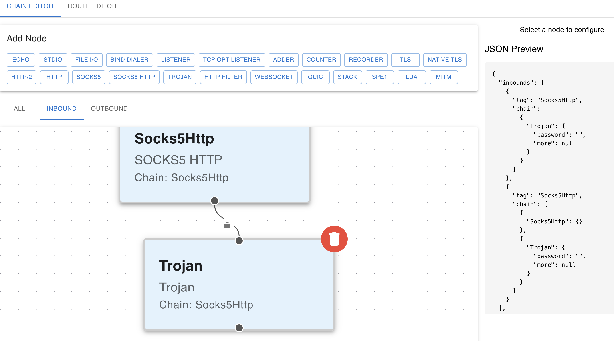

# Ruci WebUI

Ruci WebUI 是一个基于 React 和 TypeScript 的现代化 Web 用户界面项目。该项目使用了最新的前端技术栈，包括：

- React 18.3
- TypeScript
- Vite 6.0
- Material-UI (MUI) 6.3
- ReactFlow 11.11
- React Hook Form





本项目还有 tauri 分支, 可以构建 windows/linux/macos/android/ios app

## 功能特点

- 使用 Vite 构建，支持快速的开发体验和热模块替换（HMR）
- 基于 TypeScript 提供完整的类型支持
- 使用 Material-UI 组件库实现现代化的用户界面
- 集成 ReactFlow 用于可视化流程图和节点编辑
- ESLint 配置确保代码质量

## 开发指南

### 环境要求

- Node.js
- Bun (包管理器)

### 安装依赖

```bash
bun install
```

### 开发命令

```bash
# 启动开发服务器
bun dev

# 构建项目
bun build

# 代码检查
bun lint

# 预览构建结果
bun preview

#build html:

bun build --experimental-html --experimental-css ./index.html --outdir=dist

#then you can serve the dist folder by any simple http server, like python -m http.server
```

## 发布流程

项目配置了自动化的 GitHub Actions 工作流，可以在创建新标签时自动构建并发布到 GitHub Releases。

### 创建新版本

使用提供的脚本创建新版本：

```bash
# 创建新版本（例如 1.0.0）
./scripts/release.sh 1.0.0

# 推送更改和标签到 GitHub
git push && git push --tags
```

推送标签后，GitHub Actions 将自动：
1. 构建项目
2. 将 dist 目录打包为 tar.gz 文件
3. 创建 GitHub Release 并上传构建产物

## 代码

程序的入口点是 App.tsx

Map类型在 config/nodeTypes.ts 中的 NODE_TYPES 定义

将Map信息转换为 json 显示的功能是在 App.tsx 中的 getNodeChain 函数

all_ruci_config.rs 内含 ruci 配置的全部 rust 代码（已去除无用信息），用于为 nodeTypes.ts 作参考。


## License

This project is released under Unlicense License.
For more information, please refer to <http://unlicense.org/>